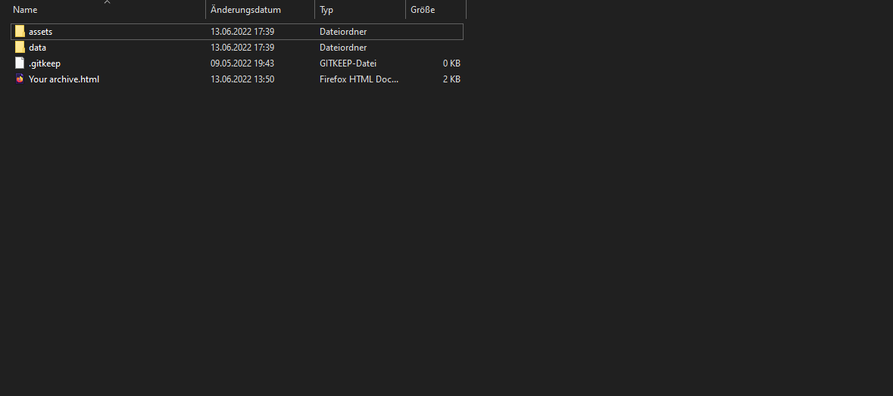
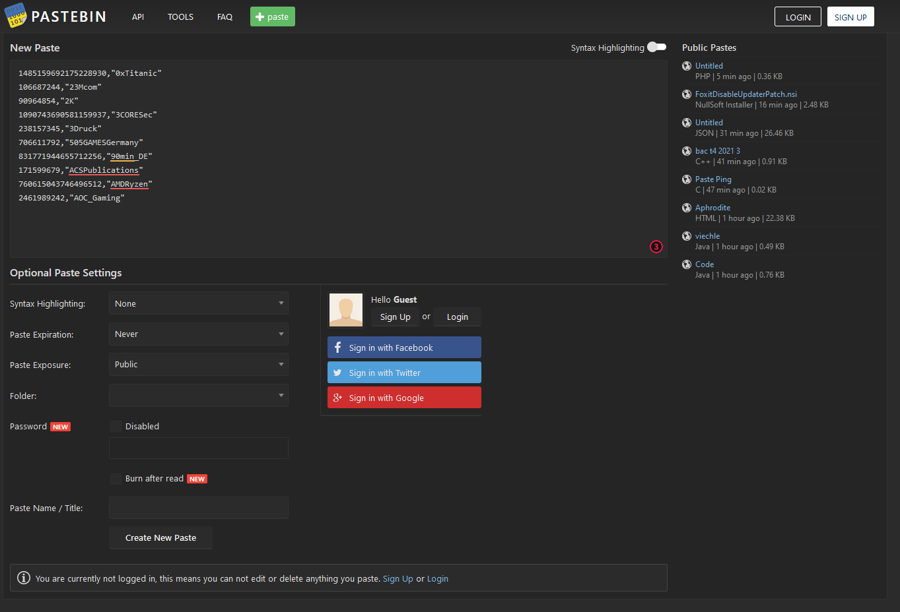
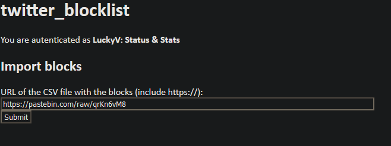
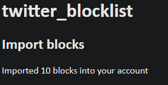

# Docs for Twitter-data-export-to-blocklist

This Page is going to instruct you how to use the program.

# Setup (Based on Windows)

Requirements for this Guide are:

- Python3 
- pip3

If you don't have Python3 installed then here is a Guide: [https://phoenixnap.com/kb/how-to-install-python-3-windows](https://phoenixnap.com/kb/how-to-install-python-3-windows)  

Continue by downloading the Repository code from here: [https://github.com/Nickwasused/twitter-data-export-to-blocklist/archive/refs/heads/main.zip](https://github.com/Nickwasused/twitter-data-export-to-blocklist/archive/refs/heads/main.zip)

Now unpack the folder to your Desktop.

At this point, you should have Python3 with pip3 installed, and a folder called "twitter-data-export-to-blocklist-main" on your desktop.

Now enter the folder, it should look like this:


After you have opened the folder, press `SHIFT` and press the Right mouse button `RMB`.

You should see something like this:


Somewhere should be a point to "Open PowerShell window here". Click on that.

A PowerShell window should open.


Now enter the following command: `pip3 install -r requirements.txt --user`.

After that, you have all required packages installed and can use the program.

# Twitter

Now you need to obtain two things:

- The Twitter Data archive
- A Twitter Developer Account (With Elevated access!)

## Twitter Archive

The first one is easy, go to the Settings > Your Account > Download an Archive of your Data (See images below)


Now wait for the email that the Archive is ready and after that extract the archive to the "export" folder in the "twitter-data-export-to-blocklist-main" folder.



# Generating the List

Now go back to your PowerShell window (the blue one) and type ```python main.py``` (or maybe ```python3 main.py```).

For converting the usernamed we use https://tweeterid.com/

This step can take longer because the website is rate limiting you.

# Uploading

Now you need to upload the generated list in a raw format.

Go back to the "twitter-data-export-to-blocklist-main" folder and right-click on the file "export.csv", after that click on edit or open in editor.

Click inside the editor window and press `STRG-A` and `STRG-C`.

Now go to the website [https://pastebin.com](https://pastebin.com) and click inside the edit field there. Now press `STRG-V`.

The Page should look similar to this:



Now click on create new paste and after that on "raw" (See below).


# Blocking

Now you need to go to [https://twitter-blocklist-auth.glitch.me/](https://twitter-blocklist-auth.glitch.me/) and log in.

After that, you paste the Pastebin link there and press submit.



After that, the page is going to tell you how many accounts got blocked.

